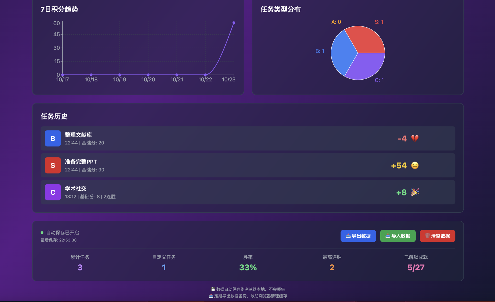
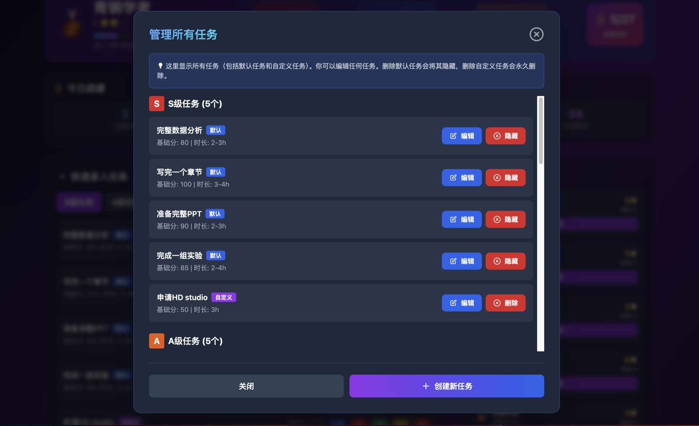
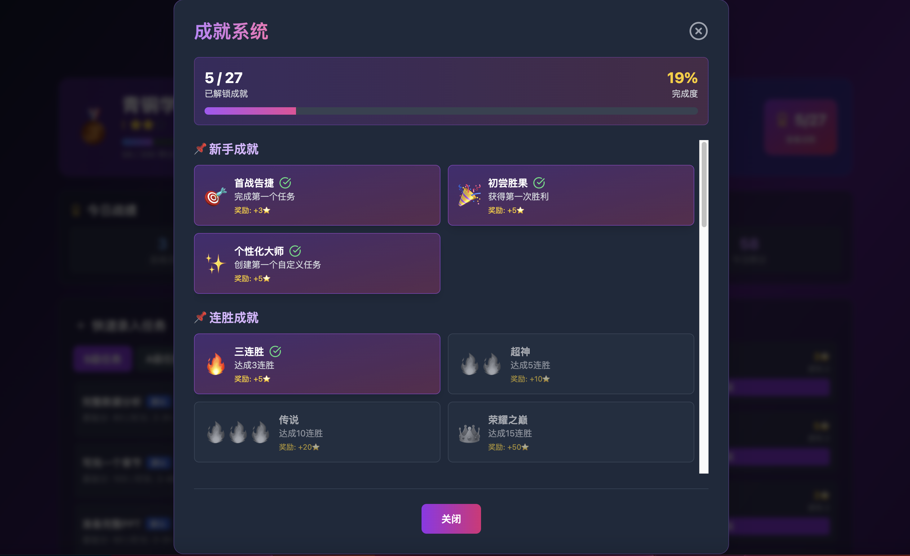

# Screenshots

## 📸 How to Add Screenshots

To make the README more visual and engaging, please add screenshots of the application to this directory.

### Available Screenshots

The `screenshots/` folder contains the following images:

1. **Dashboard Part 1** (`dashboard-1.png`)
   - Upper part of the interface with stats, rank, and quick task entry

2. **Dashboard Part 2** (`dashboard-2.png`)
   - Lower part showing buff shop, task history, and data visualization charts

3. **Task Management** (`task-management.png`)
   - Display the task management modal with custom tasks

4. **Achievement System** (`achievements.png`)
   - Show the achievement modal with unlocked/locked achievements

### Adding to README

Add screenshots to the README.md with:

```markdown
## 📷 Screenshots

### Dashboard - Upper Section

*Stats, ranking, and quick task entry interface*

### Dashboard - Lower Section

*Buff shop, task history, and data visualization charts*

### Task Management

*Create, edit, and organize custom tasks*

### Achievement System

*Track progress and unlock achievements*
```

### Tips for Good Screenshots

- Use a consistent window size (1920x1080 or 1440x900)
- Capture the full interface with some example data
- Compress images to reduce file size
- Use PNG format for better quality
- Show realistic usage scenarios with actual content

### Screenshot Directory Structure

```
research-app/
├── screenshots/
│   ├── dashboard-1.png
│   ├── dashboard-2.png
│   ├── task-management.png
│   └── achievements.png
├── README.md
└── ...
```

---

**Note**: Screenshots are optional but highly recommended for better project presentation on GitHub!
